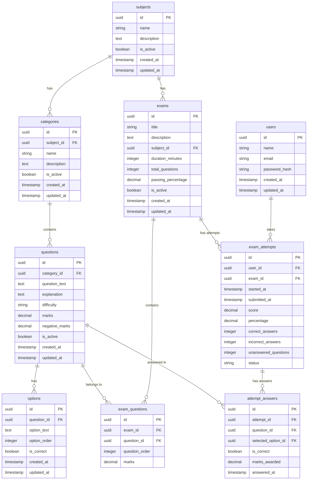

# Android MCQ Exam App - Architecture & Design Document

## 1. Overall Architecture

### System Overview
The system follows a clean three-tier architecture:
- **Frontend**: Android application using Jetpack Compose, MVVM pattern
- **Backend**: REST API using Node.js/Express with TypeScript
- **Database**: PostgreSQL relational database

### Key Design Principles
1. **Separation of Concerns**: Android app is completely decoupled from database implementation
2. **API-First Design**: All data flows through REST APIs
3. **Extensibility**: New questions/exams can be added without Android app updates
4. **Security**: Correct answers never exposed during active exam
5. **Offline-Ready**: Room database caches data for offline access

### Architecture Diagram
```
┌─────────────────────────────────────────────────────────────────┐
│                        Android App                              │
│  ┌──────────────┐  ┌──────────────┐  ┌──────────────┐         │
│  │   Compose UI │◄─│  ViewModels  │◄─│  Use Cases   │         │
│  └──────────────┘  └──────────────┘  └──────────────┘         │
│                            │                                     │
│                            ▼                                     │
│  ┌──────────────┐  ┌──────────────┐  ┌──────────────┐         │
│  │    Hilt DI   │  │ Repository   │  │ Room Cache   │         │
│  └──────────────┘  └──────────────┘  └──────────────┘         │
│                            │                                     │
└────────────────────────────┼─────────────────────────────────────┘
                             │ HTTPS
                             ▼
┌─────────────────────────────────────────────────────────────────┐
│                    Backend API (Express)                        │
│  ┌──────────────┐  ┌──────────────┐  ┌──────────────┐         │
│  │  Controllers │◄─│   Services   │◄─│  Repositories │         │
│  └──────────────┘  └──────────────┘  └──────────────┘         │
│                            │                                     │
│                            ▼                                     │
│  ┌──────────────┐  ┌──────────────┐  ┌──────────────┐         │
│  │   Middleware │  │ Validation   │  │   Auth JWT   │         │
│  └──────────────┘  └──────────────┘  └──────────────┘         │
└────────────────────────────┼─────────────────────────────────────┘
                             │
                             ▼
┌─────────────────────────────────────────────────────────────────┐
│                  PostgreSQL Database                             │
│  ┌──────────┐ ┌──────────┐ ┌──────────┐ ┌──────────┐           │
│  │ subjects │ │categories│ │  exams   │ │questions │           │
│  └──────────┘ └──────────┘ └──────────┘ └──────────┘           │
│  ┌──────────┐ ┌──────────┐ ┌──────────┐ ┌──────────┐           │
│  │  options │ │ exam_    │ │ exam_    │ │ attempt_ │           │
│  │          │ │ questions│ │ attempts │ │ answers  │           │
│  └──────────┘ └──────────┘ └──────────┘ └──────────┘           │
└─────────────────────────────────────────────────────────────────┘
```

## 2. Database Schema

### Entity Relationship Diagram


### Table Details

#### users
- Stores user authentication and profile information
- Passwords hashed using bcrypt
- Future: OAuth integration ready

#### subjects
- Top-level categorization (e.g., "Mathematics", "Science")
- Many-to-one relationship with categories
- Soft delete via `is_active` flag

#### categories
- Subject-specific categories (e.g., "Algebra", "Calculus" under Mathematics)
- Links to subjects for hierarchical organization
- Soft delete via `is_active` flag

#### exams
- Defines exam metadata (duration, passing score, etc.)
- Links to subjects
- Soft delete via `is_active` flag
- Questions linked via `exam_questions` junction table

#### questions
- Individual questions with metadata
- Difficulty levels: "easy", "medium", "hard"
- Marks and negative marking configurable per question
- Links to categories
- Soft delete via `is_active` flag

#### options
- Multiple choice options for each question
- Exactly one option marked as `is_correct` per question
- Order matters for UI display
- Soft delete via `is_active` flag

#### exam_questions
- Junction table linking exams to questions
- Allows questions to be reused across exams
- Configurable marks per exam (can override question default)
- Question order for sequencing

#### exam_attempts
- Records user exam attempts
- Tracks timing, score, and status
- Status values: "in_progress", "submitted", "timed_out"
- Server-calculated score (authoritative)

#### attempt_answers
- Stores user's selected answers for each attempt
- Records correctness and marks awarded
- Timestamp for each answer
- Enables detailed review

## 3. API Structure

### Base URL
```
http://localhost:3000/api
```

### Authentication
- JWT-based authentication
- Authorization header: `Bearer <token>`
- Public endpoints: exam listing, exam details (for preview)
- Protected endpoints: exam start, submit, review, history

### Endpoints

#### Public Endpoints

**GET /exams**
- Returns list of active exams
- Query params: `?subject_id=xxx`, `?category_id=xxx`
- Response: Array of exam summaries

**GET /exams/:id**
- Returns exam details including question count
- Does NOT include questions (security)
- Response: Exam metadata

**GET /exams/:id/questions**
- Returns questions for an exam
- IMPORTANT: Does NOT include `is_correct` in options
- Only available after exam start (requires attempt_id)
- Response: Questions with options (sans correct answers)

#### Protected Endpoints (Require Auth)

**POST /exams/:id/start**
- Starts a new exam attempt
- Creates exam_attempt record
- Returns attempt_id and full questions (sans correct answers)
- Response: Attempt data + questions

**POST /attempts/:id/submit**
- Submits exam for grading
- Server validates and calculates score
- Returns final results with correct answers
- Response: Full results with review data

**GET /attempts/:id/review**
- Returns detailed review of completed attempt
- Includes correct answers and explanations
- Response: Questions with correct answers

**GET /users/:userId/attempts**
- Returns user's attempt history
- Query params: `?exam_id=xxx`, `?limit=10`
- Response: Array of attempt summaries

**POST /auth/register**
- User registration
- Returns JWT token

**POST /auth/login**
- User login
- Returns JWT token

### API Response Format

**Exam DTO**
```json
{
  "id": "uuid",
  "title": "string",
  "description": "string",
  "subject": {
    "id": "uuid",
    "name": "string"
  },
  "duration_minutes": 60,
  "total_questions": 20,
  "passing_percentage": 70.0
}
```

**Question DTO (During Exam)**
```json
{
  "id": "uuid",
  "question_text": "string",
  "explanation": "string",
  "difficulty": "medium",
  "marks": 1.0,
  "negative_marks": 0.25,
  "options": [
    {
      "id": "uuid",
      "option_text": "string",
      "option_order": 1
    }
  ]
}
```

**Question DTO (After Submission)**
```json
{
  "id": "uuid",
  "question_text": "string",
  "explanation": "string",
  "difficulty": "medium",
  "marks": 1.0,
  "negative_marks": 0.25,
  "options": [
    {
      "id": "uuid",
      "option_text": "string",
      "option_order": 1,
      "is_correct": true
    }
  ],
  "user_answer": {
    "option_id": "uuid",
    "is_correct": false,
    "marks_awarded": -0.25
  }
}
```

## 4. Android Module Structure

```
app/
├── data/
│   ├── local/
│   │   ├── database/
│   │   │   ├── AppDatabase.kt
│   │   │   ├── entities/
│   │   │   │   ├── ExamEntity.kt
│   │   │   │   ├── QuestionEntity.kt
│   │   │   │   └── AttemptEntity.kt
│   │   │   └── dao/
│   │   │       ├── ExamDao.kt
│   │   │       └── AttemptDao.kt
│   │   └── preferences/
│   │       └── UserPreferences.kt
│   ├── remote/
│   │   ├── api/
│   │   │   ├── ApiService.kt
│   │   │   ├── AuthApi.kt
│   │   │   └── ExamApi.kt
│   │   ├── dto/
│   │   │   ├── ExamDto.kt
│   │   │   ├── QuestionDto.kt
│   │   │   └── AttemptDto.kt
│   │   └── mapper/
│   │       └── DtoMapper.kt
│   └── repository/
│       ├── ExamRepository.kt
│       ├── QuestionRepository.kt
│       ├── AttemptRepository.kt
│       └── AuthRepository.kt
├── domain/
│   ├── model/
│   │   ├── Exam.kt
│   │   ├── Question.kt
│   │   ├── Option.kt
│   │   ├── Attempt.kt
│   │   └── User.kt
│   ├── repository/
│   │   ├── IExamRepository.kt
│   │   ├── IQuestionRepository.kt
│   │   ├── IAttemptRepository.kt
│   │   └── IAuthRepository.kt
│   └── usecase/
│       ├── GetExamsUseCase.kt
│       ├── StartExamUseCase.kt
│       ├── SubmitExamUseCase.kt
│       ├── GetAttemptHistoryUseCase.kt
│       └── LoginUseCase.kt
├── presentation/
│   ├── navigation/
│   │   ├── Screen.kt
│   │   └── NavGraph.kt
│   ├── home/
│   │   ├── HomeScreen.kt
│   │   └── HomeViewModel.kt
│   ├── exams/
│   │   ├── ExamListScreen.kt
│   │   ├── ExamListViewModel.kt
│   │   ├── ExamDetailScreen.kt
│   │   └── ExamDetailViewModel.kt
│   ├── exam/
│   │   ├── ExamScreen.kt
│   │   ├── ExamViewModel.kt
│   │   └── ExamTimer.kt
│   ├── result/
│   │   ├── ResultScreen.kt
│   │   └── ResultViewModel.kt
│   ├── review/
│   │   ├── ReviewScreen.kt
│   │   └── ReviewViewModel.kt
│   ├── history/
│   │   ├── HistoryScreen.kt
│   │   └── HistoryViewModel.kt
│   └── common/
│       ├── components/
│       │   ├── QuestionCard.kt
│       │   ├── OptionButton.kt
│       │   └── TimerDisplay.kt
│       └── theme/
│           ├── Color.kt
│           ├── Theme.kt
│           └── Type.kt
├── di/
│   ├── AppModule.kt
│   ├── DatabaseModule.kt
│   ├── NetworkModule.kt
│   └── RepositoryModule.kt
└── MainActivity.kt
```

## 5. Data Flow

### Exam Browsing Flow
```
User → HomeScreen → ExamListViewModel
  → GetExamsUseCase → ExamRepository
  → [Remote API] → Local Cache (Room)
  → ExamDto → Exam (Domain Model)
  → StateFlow → Compose UI
```

### Exam Taking Flow
```
User → ExamScreen → ExamViewModel
  → StartExamUseCase → ExamRepository
  → POST /exams/:id/start
  → API returns attempt_id + questions (sans correct answers)
  → Questions cached locally for offline
  → User answers stored in ViewModel
  → Navigation preserves state
  → Submit → SubmitExamUseCase
  → POST /attempts/:id/submit
  → Server calculates score
  → API returns results with correct answers
  → ResultScreen displays results
```

### Answer Review Flow
```
User → ResultScreen → ReviewButton
  → ReviewScreen → ReviewViewModel
  → GetReviewUseCase → AttemptRepository
  → GET /attempts/:id/review
  → API returns questions with correct answers
  → Display with user's answers highlighted
```

### Offline/Cache Flow
```
Remote API → Repository
  → Save to Room (Local Cache)
  → Next request: Check Room first
  → If fresh (within TTL), use cache
  → If stale or missing, fetch from API
  → Update cache
  → Return to ViewModel
```

## 6. Future Extensibility

### Adding New Questions
1. Admin adds question via web panel (future)
2. POST /questions API endpoint
3. Question inserted into database
4. Admin adds to exam via /exams/:id/questions
5. No Android changes needed
6. Android app fetches updated questions on next API call

### Adding New Exams
1. Admin creates exam via web panel (future)
2. POST /exams API endpoint
3. Exam inserted into database
4. Admin adds questions to exam
5. No Android changes needed
6. Android app shows new exam in list

### Updating Questions
1. Admin updates question via web panel
2. PUT /questions/:id API endpoint
3. Question updated in database
4. Future exam attempts use updated version
5. Historical attempts preserve original (via attempt_answers)
6. No Android changes needed

### Changing Exam Configuration
1. Admin updates exam duration, passing percentage
2. PUT /exams/:id API endpoint
3. Exam metadata updated
4. Future attempts use new configuration
5. No Android changes needed

### Adding Subjects/Categories
1. Admin adds subject/category via web panel
2. POST /subjects or POST /categories
3. New metadata available
4. Android app filters by subject/category
5. No Android changes needed

### Schema Changes
1. Create new migration file
2. Add column/table with default values
3. Deploy migration
4. Update API DTOs if needed
5. Android app can optionally use new fields
6. Backward compatibility maintained via optional fields

## 7. Security Considerations

### API Security
- HTTPS in production
- JWT authentication with expiration
- Rate limiting per user
- Input validation on all endpoints
- SQL injection prevention (parameterized queries)

### Exam Security
- Correct answers never sent during active exam
- Server-side score calculation (authoritative)
- Attempt timeout enforced by server
- No client-side trust for scoring
- Answer validation on submission

### Data Security
- Passwords hashed with bcrypt
- Sensitive fields never logged
- API tokens stored securely (Android Keystore)
- User data isolation via user_id

## 8. Technology Stack

### Backend
- Node.js 20+
- Express.js
- TypeScript
- PostgreSQL 15+
- Prisma ORM (for migrations and type safety)
- bcrypt (password hashing)
- jsonwebtoken (JWT)
- cors (CORS handling)
- helmet (security headers)

### Android
- Kotlin 1.9+
- Jetpack Compose
- Material 3
- Hilt (Dependency Injection)
- Retrofit 2.9+
- OkHttp 4.12+
- Room 2.6+
- Coroutines + Flow
- Navigation Compose
- Coil (Image loading)
- Kotlinx Serialization

### Development Tools
- Gradle Kotlin DSL
- Android Studio Hedgehog+
- PostgreSQL client
- Postman/Insomnia (API testing)
- Git

## 9. Performance Considerations

### Database
- Indexes on foreign keys and frequently queried fields
- Connection pooling
- Query optimization for exam question loading

### API
- Pagination for large lists
- Caching headers for static data
- Gzip compression
- Lazy loading for question explanations

### Android
- Room database for offline caching
- Lazy loading of UI components
- StateFlow for reactive updates
- Paging 3 for large lists
- Image caching

## 10. Testing Strategy

### Backend Tests
- Unit tests for business logic
- Integration tests for API endpoints
- Database migration tests
- Score calculation tests

### Android Tests
- Unit tests for ViewModels
- Unit tests for Use Cases
- Unit tests for Repository
- Unit tests for Mappers
- UI tests for critical flows (Espresso/Compose Testing)
- Instrumented tests for Room database

### End-to-End Tests
- Complete exam flow
- Answer submission
- Result calculation
- Offline caching
