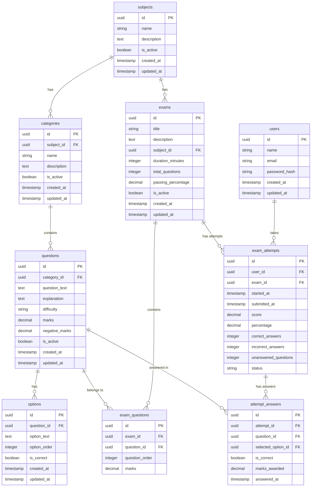

# MCQ Exam Application

A production-ready Android MCQ (Multiple Choice Question) Exam Application with a REST API backend and PostgreSQL database.

## Features

- **Android App**: Modern Jetpack Compose UI with Material 3 design
- **Backend API**: Node.js/Express REST API with TypeScript
- **Database**: PostgreSQL with normalized relational schema
- **Authentication**: JWT-based authentication
- **Exam Management**: Browse exams, take exams, submit, and review results
- **Attempt History**: Track previous exam attempts
- **Extensible Design**: Add/update questions without Android app changes
- **Security**: Correct answers not exposed during active exams
- **Offline Support**: Room database for local caching (architecture ready)

## Architecture

The application follows a clean three-tier architecture:

```
Android App (Compose + MVVM) → REST API (Express) → PostgreSQL Database
```

### Key Design Principles

1. **API-First Design**: All data flows through REST APIs
2. **Separation of Concerns**: Android app decoupled from database
3. **Extensibility**: New questions/exams added without app updates
4. **Security**: Server authoritative for score calculation
5. **Clean Architecture**: MVVM pattern with Repository pattern

For detailed architecture documentation, see [ARCHITECTURE.md](ARCHITECTURE.md).

## Database Schema

### Entity Relationship Diagram



### Table Descriptions

#### users
Stores user authentication and profile information.

#### subjects
Top-level categorization (e.g., "Mathematics", "Science").

#### categories
Subject-specific categories (e.g., "Algebra", "Calculus" under Mathematics).

#### exams
Defines exam metadata (duration, passing score, etc.).

#### questions
Individual questions with metadata (difficulty, marks, negative marking).

#### options
Multiple choice options for each question. Exactly one option marked as correct.

#### exam_questions
Junction table linking exams to questions. Allows questions to be reused across exams.

#### exam_attempts
Records user exam attempts with timing, score, and status.

#### attempt_answers
Stores user's selected answers for each attempt with correctness and marks awarded.

## Technology Stack

### Backend
- Node.js 20+
- Express.js
- TypeScript
- PostgreSQL 15+
- bcrypt (password hashing)
- jsonwebtoken (JWT)
- cors, helmet (security)

### Android
- Kotlin 1.9+
- Jetpack Compose
- Material 3
- Hilt (Dependency Injection)
- Retrofit 2.9+
- OkHttp 4.12+
- Room 2.6+
- Coroutines + Flow
- Navigation Compose
- Gradle Kotlin DSL

## Setup Instructions

### Prerequisites

- Node.js 20+ and npm
- PostgreSQL 15+
- Android Studio Hedgehog+ (for Android development)
- JDK 17

### Backend Setup

1. **Navigate to backend directory**
   ```bash
   cd backend
   ```

2. **Install dependencies**
   ```bash
   npm install
   ```

3. **Configure environment variables**
   ```bash
   cp .env.example .env
   ```

   Edit `.env` with your database credentials:
   ```
   DB_HOST=localhost
   DB_PORT=5432
   DB_NAME=mcq_exam_db
   DB_USER=postgres
   DB_PASSWORD=your_password
   PORT=3000
   JWT_SECRET=your_super_secret_jwt_key
   JWT_EXPIRES_IN=7d
   CORS_ORIGIN=http://localhost:8080
   ```

4. **Create PostgreSQL database**
   ```bash
   createdb mcq_exam_db
   ```

5. **Run database migrations**
   ```bash
   npm run migrate
   ```

6. **Seed the database with sample data**
   ```bash
   npm run seed
   ```

   This creates:
   - 1 test user: `test@example.com` / `password123`
   - 2 subjects (Mathematics, Science)
   - 3 categories (Algebra, Calculus, Physics)
   - 3 exams
   - 21 sample questions

7. **Start the backend server**
   ```bash
   npm run dev
   ```

   The API will be available at `http://localhost:3000`

### Android Setup

1. **Open the project in Android Studio**
   ```bash
   # Open the project root directory in Android Studio
   ```

2. **Configure API base URL**
   
   Edit `app/src/main/java/com/mcq/exam/di/NetworkModule.kt`:
   ```kotlin
   private const val BASE_URL = "http://10.0.2.2:3000/api/" // For Android emulator
   // For real device: use your computer's IP address
   // For local testing: "http://localhost:3000/api/"
   ```

   **Note**: `10.0.2.2` is the special IP address to access localhost from Android emulator.

3. **Sync Gradle**
   - Android Studio will automatically sync Gradle
   - If not, click "Sync Project with Gradle Files"

4. **Build the project**
   - Build → Make Project
   - Or run: `./gradlew build`

5. **Run the app**
   - Connect an Android device or start an emulator
   - Click Run in Android Studio
   - Or run: `./gradlew installDebug`

## API Documentation

### Base URL
```
http://localhost:3000/api
```

### Authentication Endpoints

#### POST /register
Register a new user.

**Request Body:**
```json
{
  "name": "John Doe",
  "email": "john@example.com",
  "password": "password123"
}
```

**Response:**
```json
{
  "user": {
    "id": "uuid",
    "name": "John Doe",
    "email": "john@example.com"
  },
  "token": "jwt_token"
}
```

#### POST /login
Login with email and password.

**Request Body:**
```json
{
  "email": "john@example.com",
  "password": "password123"
}
```

**Response:**
```json
{
  "user": {
    "id": "uuid",
    "name": "John Doe",
    "email": "john@example.com"
  },
  "token": "jwt_token"
}
```

### Exam Endpoints

#### GET /exams
Get list of all active exams.

**Query Parameters:**
- `subject_id` (optional): Filter by subject

**Response:**
```json
[
  {
    "id": "uuid",
    "title": "Algebra Basics",
    "description": "Test your algebra skills",
    "subject": {
      "id": "uuid",
      "name": "Mathematics"
    },
    "duration_minutes": 30,
    "total_questions": 8,
    "passing_percentage": 70.0
  }
]
```

#### GET /exams/:id
Get details of a specific exam.

**Response:**
```json
{
  "id": "uuid",
  "title": "Algebra Basics",
  "description": "Test your algebra skills",
  "subject": {
    "id": "uuid",
    "name": "Mathematics"
  },
  "duration_minutes": 30,
  "total_questions": 8,
  "passing_percentage": 70.0
}
```

#### POST /exams/:id/start (Protected)
Start a new exam attempt. Requires JWT token in Authorization header.

**Headers:**
```
Authorization: Bearer <token>
```

**Response:**
```json
{
  "attempt_id": "uuid",
  "exam": { ... },
  "questions": [
    {
      "id": "uuid",
      "question_text": "What is 2 + 2?",
      "explanation": "Basic addition",
      "difficulty": "easy",
      "marks": 1.0,
      "negative_marks": 0.25,
      "options": [
        {
          "id": "uuid",
          "option_text": "4",
          "option_order": 1
          // Note: is_correct is NOT included during active exam
        }
      ]
    }
  ],
  "duration_minutes": 30
}
```

#### POST /attempts/:id/submit (Protected)
Submit exam for grading. Requires JWT token.

**Request Body:**
```json
{
  "answers": [
    {
      "question_id": "uuid",
      "selected_option_id": "uuid"
    }
  ]
}
```

**Response:**
```json
{
  "attempt": {
    "id": "uuid",
    "exam": { ... },
    "started_at": "2024-01-01T10:00:00Z",
    "submitted_at": "2024-01-01T10:30:00Z",
    "score": 7.0,
    "percentage": 87.5,
    "correct_answers": 7,
    "incorrect_answers": 1,
    "unanswered_questions": 0,
    "status": "submitted"
  },
  "questions": [
    {
      "id": "uuid",
      "question_text": "What is 2 + 2?",
      "explanation": "Basic addition",
      "difficulty": "easy",
      "marks": 1.0,
      "negative_marks": 0.25,
      "options": [
        {
          "id": "uuid",
          "option_text": "4",
          "option_order": 1,
          "is_correct": true  // Now included after submission
        }
      ],
      "user_answer": {
        "option_id": "uuid",
        "is_correct": true,
        "marks_awarded": 1.0
      }
    }
  ],
  "passed": true
}
```

#### GET /attempts/:id/review (Protected)
Get detailed review of a completed attempt. Requires JWT token.

**Response:**
```json
{
  "attempt": { ... },
  "questions": [
    {
      "id": "uuid",
      "question_text": "What is 2 + 2?",
      "explanation": "Basic addition",
      "difficulty": "easy",
      "marks": 1.0,
      "negative_marks": 0.25,
      "options": [
        {
          "id": "uuid",
          "option_text": "4",
          "option_order": 1,
          "is_correct": true
        }
      ],
      "user_answer": {
        "option_id": "uuid",
        "is_correct": true,
        "marks_awarded": 1.0
      }
    }
  ]
}
```

#### GET /attempts (Protected)
Get user's attempt history. Requires JWT token.

**Query Parameters:**
- `exam_id` (optional): Filter by exam

**Response:**
```json
[
  {
    "id": "uuid",
    "exam": { ... },
    "started_at": "2024-01-01T10:00:00Z",
    "submitted_at": "2024-01-01T10:30:00Z",
    "score": 7.0,
    "percentage": 87.5,
    "correct_answers": 7,
    "incorrect_answers": 1,
    "unanswered_questions": 0,
    "status": "submitted"
  }
]
```

## How to Add Content

### Adding a New Question

1. **Insert into database directly:**
   ```sql
   INSERT INTO questions (category_id, question_text, explanation, difficulty, marks, negative_marks)
   VALUES ('category-uuid', 'Your question text?', 'Explanation', 'medium', 1.0, 0.25)
   RETURNING id;
   ```

2. **Add options:**
   ```sql
   INSERT INTO options (question_id, option_text, option_order, is_correct)
   VALUES
     ('question-uuid', 'Option 1', 1, false),
     ('question-uuid', 'Option 2', 2, true),
     ('question-uuid', 'Option 3', 3, false),
     ('question-uuid', 'Option 4', 4, false);
   ```

3. **Add to exam:**
   ```sql
   INSERT INTO exam_questions (exam_id, question_id, question_order, marks)
   VALUES ('exam-uuid', 'question-uuid', 1, 1.0);
   ```

### Adding a New Exam

```sql
INSERT INTO exams (title, description, subject_id, duration_minutes, total_questions, passing_percentage)
VALUES ('New Exam', 'Description', 'subject-uuid', 60, 20, 70.0)
RETURNING id;
```

Then add questions using the exam-questions junction table.

### Adding a New Subject

```sql
INSERT INTO subjects (name, description)
VALUES ('Physics', 'Study of matter and energy')
RETURNING id;
```

### Adding a New Category

```sql
INSERT INTO categories (subject_id, name, description)
VALUES ('subject-uuid', 'Mechanics', 'Study of motion and forces')
RETURNING id;
```

## Database Migrations

### Running Migrations

```bash
cd backend
npm run migrate
```

### Creating New Migrations

1. Create a new migration file in `backend/src/utils/`
2. Add SQL statements to the migrations array in `migrate.ts`
3. Run `npm run migrate`

### Migration Strategy

- All migrations are idempotent (can be run multiple times safely)
- Use `IF NOT EXISTS` for table creation
- Use `ON CONFLICT DO NOTHING` for data insertion
- Future: Consider using a migration tool like Knex.js or Prisma

## Running Tests

### Backend Tests

```bash
cd backend
npm test
```

### Android Tests

```bash
# Unit tests
./gradlew test

# Instrumented tests
./gradlew connectedAndroidTest
```

## Building the APK

```bash
# Debug APK
./gradlew assembleDebug

# Release APK
./gradlew assembleRelease
```

APK location: `app/build/outputs/apk/`

## Project Structure

### Backend
```
backend/
├── src/
│   ├── config/          # Database configuration
│   ├── controllers/     # Request handlers
│   ├── middleware/      # Express middleware (auth, etc.)
│   ├── models/          # TypeScript interfaces/types
│   ├── repositories/    # Data access layer
│   ├── routes/          # API route definitions
│   ├── server.ts        # Express app entry point
│   └── utils/           # Utilities (migrations, seed)
├── package.json
├── tsconfig.json
└── .env.example
```

### Android
```
app/
├── data/
│   ├── local/           # Room database (caching)
│   ├── remote/          # Retrofit API, DTOs, mappers
│   └── repository/      # Repository implementations
├── domain/
│   ├── model/           # Domain models
│   ├── repository/      # Repository interfaces
│   └── usecase/         # Business logic use cases
├── presentation/
│   ├── navigation/      # Navigation graph
│   ├── home/            # Home screen
│   ├── exams/           # Exam detail screen
│   ├── exam/            # Exam taking screen
│   ├── result/          # Result screen
│   ├── review/          # Review screen
│   └── common/          # Shared UI components, theme
├── di/                  # Dependency injection modules
└── MainActivity.kt
```

## Security Considerations

1. **Password Security**: Passwords hashed with bcrypt
2. **JWT Authentication**: Token-based authentication with expiration
3. **API Security**: 
   - Correct answers not exposed during active exam
   - Server-side score calculation (authoritative)
   - Input validation on all endpoints
4. **HTTPS**: Use HTTPS in production
5. **CORS**: Configured for allowed origins
6. **Helmet**: Security headers enabled

## Future Enhancements

1. **Admin Panel**: Web interface for content management
2. **Real-time Sync**: WebSocket for live exam updates
3. **Offline Mode**: Full offline exam taking capability
4. **Analytics**: Dashboard for exam statistics
5. **Multi-language**: i18n support
6. **Question Types**: Support for multiple correct answers, drag-and-drop, etc.
7. **Exam Categories**: Group exams by difficulty or type
8. **Leaderboards**: Ranking system
9. **Certificates**: Generate PDF certificates on passing
10. **Question Pool**: Random selection from larger question pools

## Troubleshooting

### Backend Issues

**Database connection failed:**
- Verify PostgreSQL is running
- Check credentials in `.env`
- Ensure database exists: `createdb mcq_exam_db`

**Port already in use:**
- Change PORT in `.env`
- Kill process using port 3000: `lsof -ti:3000 | xargs kill`

### Android Issues

**API connection failed:**
- Verify backend is running
- Check BASE_URL in NetworkModule.kt
- For emulator: Use `10.0.2.2` instead of `localhost`
- For real device: Use your computer's IP address

**Build errors:**
- Sync Gradle: File → Sync Project with Gradle Files
- Clean build: Build → Clean Project
- Invalidate caches: File → Invalidate Caches / Restart

## License

MIT License

## Contributing

1. Fork the repository
2. Create a feature branch
3. Commit your changes
4. Push to the branch
5. Create a Pull Request

## Support

For issues and questions, please open an issue on GitHub.
